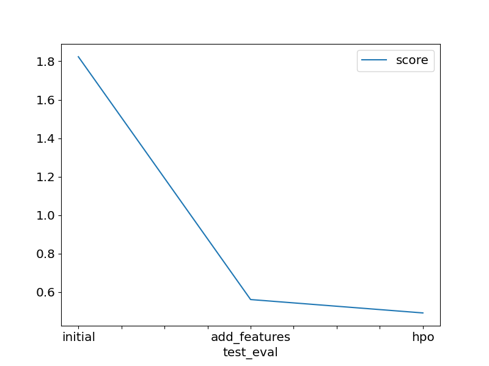

# Report: Predict Bike Sharing Demand with AutoGluon Solution
#### NAME HERE

## Initial Training
### What did you realize when you tried to submit your predictions? What changes were needed to the output of the predictor to submit your results?

First of all, competition on Kaggle does not accept negative predictions. Therefore, we must always ensure that our predictions do not have negative values by setting them to $0$. Next, we must always send the data in the correct format as specified in the "sampleSubmission.csv" file.

### What was the top ranked model that performed?
The `Weighted Ensemble L3` model had the best performance in the third stage of the project, where we created new features and chose some hyperparameters.

## Exploratory data analysis and feature creation
### What did the exploratory analysis find and how did you add additional features?
The exploratory analysis showed us that the time variable was not in its ideal format, it was classified as an `object`. Thus, we convert its format to `datetime`, and separate the date into month, day, day of the week and time.

### How much better did your model preform after adding additional features and why do you think that is?
The performance of the model has improved a lot, before we had a score of approximately $1.852$ and with the addition of temporal variables we obtain $0.670$ This means that time is a very important variable for demand forecasting and we must consider it in the model. This conclusion is quite reasonable, considering that we are dealing with a time series.

## Hyper parameter tuning
### How much better did your model preform after trying different hyper parameters?
With the choice of some hyperparameters, the performance of our model improved significantly. Despite a small change, we know that any improvement is important in competitions. The model before had a score around $0.670$ and went to $0.629$.

### If you were given more time with this dataset, where do you think you would spend more time?
I would certainly spend more time exploring the data better, and creating new variables for the model, as the variables affected the performance of the model more considerably.

### Create a table with the models you ran, the hyperparameters modified, and the kaggle score.
|model|hpo1|hpo2|hpo3|score|
|--|--|--|--|--|
|initial|default|default|default|1.85205|
|add_features|default|default|default|0.67043|
|hpo|num_trials: 5|scheduler: local|searcher: auto|0.62913|

### Create a line plot showing the top model score for the three (or more) training runs during the project.

### Create a line plot showing the top kaggle score for the three (or more) prediction submissions during the project.

## Summary
TODO: Add your explanation
