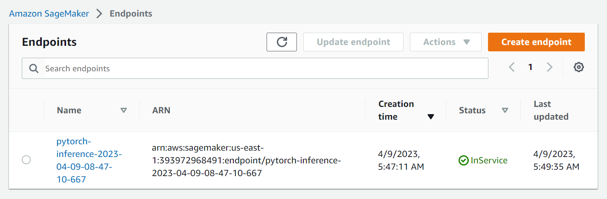

# Image Classification using AWS SageMaker

Use AWS Sagemaker to train a pretrained model that can perform image classification by using the Sagemaker profiling, debugger, hyperparameter tuning and other good ML engineering practices. This can be done on either the provided dog breed classication data set or one of your choice.

## Project Set Up and Installation
Enter AWS through the gateway in the course and open SageMaker Studio. 
Download the starter files.
Download/Make the dataset available. 

## Dataset
The provided dataset is the dogbreed classification dataset which can be found in the classroom.
The project is designed to be dataset independent so if there is a dataset that is more interesting or relevant to your work, you are welcome to use it to complete the project.

### Access
Upload the data to an S3 bucket through the AWS Gateway so that SageMaker has access to the data. 

## Hyperparameter Tuning
I utilized a pretrained ResNet50 and fine-tuned its performance by adjusting the parameters of learning rate, epochs, and batch size. The learning rate determines the speed at which the model converges to optimal weights, while the batch size controls the model's generalization ability based on the propagated samples. Finally, the number of epochs determines how many times the model trains on the entire dataset. After retrieving the best results from hyperparameter tuning, we trained the model using these optimal parameters.

The results of the hyperparameter tuning are as follows:

   - Batch size: 64
   - Epochs: 2
   - Learning rate: 0.004030880500753202

## Debugging and Profiling
Using the SageMaker Debugger, I created a report that contains data on the model's training, statistics on the resources used and a summary of some metrics.

### Results
After performing profiling and debugging, some suggestions were evaluated:

- Check if there are any bottlenecks (CPU, I/O) correlated to the step outliers.

- Choose a different distributed training strategy or a different distributed training framework. 	

- Check if there are bottlenecks, minimize blocking calls, change distributed training strategy, or increase the batch size. 

- Consider increasing the number of data loaders or applying data pre-fetching. 	

- Choose a larger instance type with more memory if footprint is close to maximum available memory. 

- Pre-fetch data or choose different file formats, such as binary formats that improve I/O performance

- The batch size is too small, and GPUs are underutilized. Consider running on a smaller instance type or increasing the batch size. 

- Change the number of data loader processes. 	

## Model Deployment
Finally, we deployed the endpoint using the "ml.m5.large" instance type along with the "deploy_endpoint.py" script for setup. 

