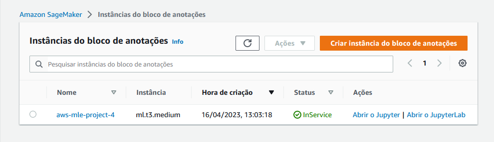
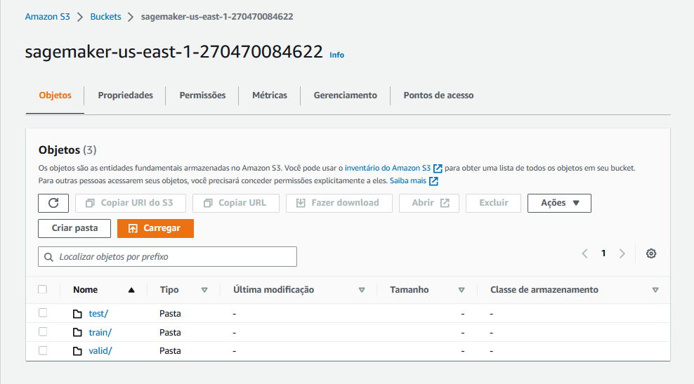
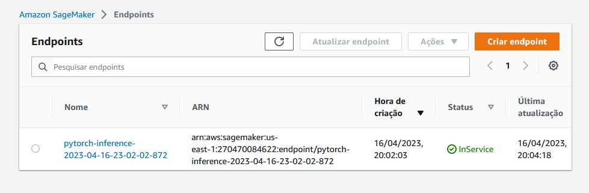
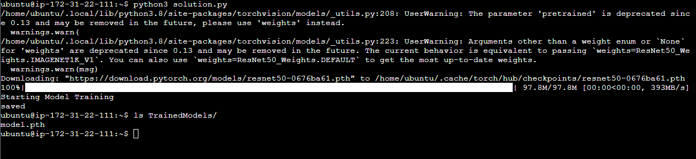
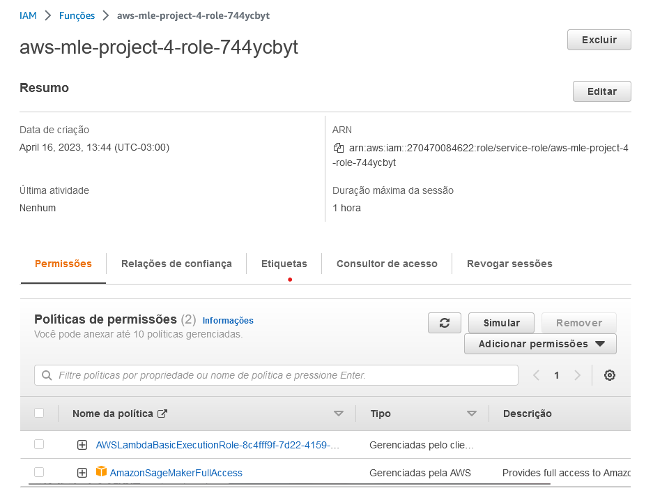
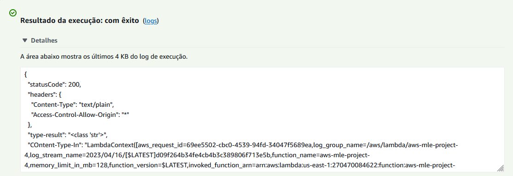
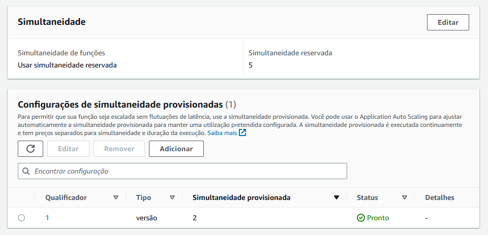
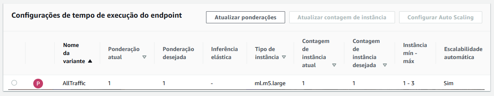

# Operationalizing-an-AWS-ML-Project
## Dog Image Classification

In this project, you will complete the following steps:

1. Train and deploy a model on Sagemaker, using the most appropriate instances. Set up multi-instance training in your Sagemaker notebook.
2. Adjust your Sagemaker notebooks to perform training and deployment on EC2.
3. Set up a Lambda function for your deployed model. Set up auto-scaling for your deployed endpoint as well as concurrency for your Lambda function.
4. Ensure that the security on your ML pipeline is set up properly.

### Step 1: Training and deployment on Sagemaker

- **Created SageMaker notebook instance** 
I have opted for ml.t3.medium as it provides sufficient capacity to run the notebook.



- **S3 bucket** (sagemaker-us-east-1-270470084622)



- **Deployment**



### Step 2: EC2 Training

Training a model on an EC2 instance is also possible. In my case, I went for an AMI that already had the required libraries installed - specifically, the Deep Learning AMI GPU PyTorch 2.0.0 which comes with the latest version of PyTorch. To keep costs low, I chose the m5.xlarge instance type.



The image above displays the EC2 instance along with the terminal running the **ec2train1.py** script for training the model.

Although the adjusted code in ec2train1.py is quite similar to the code in **train_and_deploy-solution.ipynb**, there are some differences in the modules used. Certain modules can only be used in SageMaker, and much of the EC2 training code has been adapted from the functions defined in the hpo.py starter script. Unlike ec2train.py, which trains a model with specific arguments, hpo.py parses arguments through the command line, enabling it to train multiple models with different hyperparameters.

### Step 3: Step 3: Lambda Function Setup 
Once the model is trained and deployed, setting up a Lambda function becomes an important next step. Lambda functions play a vital role in enabling access to your model and its inferences by APIs and other programs, making it a crucial step in the production deployment process.

### Step 4: Lambda security setup and testing 

- **Adding SageMaker permission to Lambda Functions**

Lambda function is going to invoke deployed endpoint. However, the lambda function will only be able to invoke endpoint if it has the proper security policies attached to it.

Two security policy has been attached to the role : 
1. Basic Lambda Function Execution 
2. Amazon SageMaker Full Access



**Vulnerability Assesment** 
- Granting 'Full Access' can resolve the authentication error, but it's crucial to acknowledge that this approach may expose your system to security risks from malicious actors. Therefore, it's advisable to adhere to the principle of least privilege by granting only the minimum permissions necessary for the task at hand.
- Roles that are old and inactive pose a potential risk to the security of Lambda functions. Therefore, it's essential to delete these roles to mitigate any potential security threats.
- Roles that have policies that are no longer in use can potentially result in unauthorized access, which is a security risk. Hence, it's recommended to remove such policies to mitigate the risk of unauthorized access.

- **Testing Lambda Function**



- **Response**
```
{
  "statusCode": 200,
  "headers": {
    "Content-Type": "text/plain",
    "Access-Control-Allow-Origin": "*"
  },
  "type-result": "<class 'str'>",
  "COntent-Type-In": "LambdaContext([aws_request_id=40c3835b-afb6-4113-9965-5d48b0b8f80c,log_group_name=/aws/lambda/aws-mle-project-4,log_stream_name=2023/04/16/[$LATEST]1dc698cf02534d1e8b944e2d6aec88bc,function_name=aws-mle-project-4,memory_limit_in_mb=128,function_version=$LATEST,invoked_function_arn=arn:aws:lambda:us-east-1:270470084622:function:aws-mle-project-4,client_context=None,identity=CognitoIdentity([cognito_identity_id=None,cognito_identity_pool_id=None])])",
  "body": "[[0.23341242969036102, 0.1201404556632042, 0.17386484146118164, 0.34716036915779114, 0.38284388184547424, 0.2696705162525177, -0.024780860170722008, 0.2748465836048126, -0.32994431257247925, -0.0027336664497852325, 0.2903044819831848, 0.239714115858078, -0.10593105852603912, 0.16950221359729767, 0.41412219405174255, 0.3923192322254181, 0.07747884839773178, -0.004034143872559071, -0.04632091149687767, 0.21375562250614166, 0.3204706609249115, -0.0412529855966568, 0.18571217358112335, 0.1314726173877716, -0.31430190801620483, -0.10718689858913422, 0.0923868790268898, -0.33783143758773804, 0.31861498951911926, 0.028727250173687935, 0.1930113285779953, 0.2503906488418579, -0.07088680565357208, 0.25849753618240356, 0.0221647247672081, 0.16759315133094788, -0.09630408138036728, 0.03821945935487747, 0.17642128467559814, -0.05622150003910065, 0.1854114532470703, -0.014759852550923824, 0.02266746386885643, 0.13891850411891937, -0.03742707893252373, 0.29135188460350037, 0.048349879682064056, 0.018420685082674026, -0.04512607678771019, -0.05058637261390686, 0.19119802117347717, 0.010953916236758232, 0.005685312673449516, 0.03861718624830246, -0.09555500000715256, 0.3293544054031372, 0.40434014797210693, -0.0104390112683177, -0.11048098653554916, 0.2650812268257141, 0.20736373960971832, 0.02980891242623329, -0.024101702496409416, -0.31992730498313904, -0.1753712147474289, -0.2275867462158203, -0.3220716714859009, 0.36454033851623535, 0.029886865988373756, -0.22013209760189056, 0.2735019326210022, -0.03558897599577904, -0.25311869382858276, -0.1781873106956482, -0.13376444578170776, 0.27971670031547546, -0.1317683905363083, -0.22922062873840332, 0.10458315163850784, -0.1579374372959137, 0.13009978830814362, 0.15039677917957306, 0.004514888860285282, -0.02491014450788498, -0.22547155618667603, 0.0344545803964138, 0.14001815021038055, 0.014607766643166542, 0.1506873071193695, 0.19606593251228333, 0.05348163843154907, -0.07449875771999359, -0.25219815969467163, -0.09033939242362976, -0.09468860924243927, -0.20304040610790253, 0.004407989326864481, -0.10100279748439789, -0.24853366613388062, -0.3196812868118286, -0.0049875471740961075, -0.4637678861618042, 0.14250138401985168, -0.2602761685848236, -0.36389797925949097, -0.08760914206504822, -0.22638839483261108, -0.7085053324699402, -0.07523494958877563, -0.4931703507900238, -0.19327642023563385, -0.016528747975826263, -0.2478392869234085, -0.46199724078178406, 0.2235019952058792, -0.5685762166976929, -0.029336730018258095, 0.0773257464170456, -0.4245701730251312, -0.2962212562561035, -0.5610048174858093, -0.3744206726551056, -0.16977612674236298, -0.06874315440654755, -0.36301755905151367, -0.47189927101135254, -0.16460078954696655, -0.5586852431297302, -0.1107543557882309, -0.08528206497430801, -0.4137706160545349, -0.6410139799118042, -0.42030930519104004]]"
}
```
### Step 5: Lambda Concurrency setup and Endpoint Auto-scaling

- **Concurrency**

Enabling concurrency for your Lambda function can improve its ability to handle high traffic by allowing it to respond to multiple invocations simultaneously. I opted to reserve five instances and provisioned two of them.

There are two types of concurrency to consider:

>  Provisioned concurrency: This involves computing resources that are immediately available for use in response to requests to a Lambda function. It's a low-cost option; however, the maximum number of instances is a hard limit. Therefore, if the Lambda function receives more requests than the maximum number of instances, there may be latency in processing requests.

> Reserved concurrency: This involves a set amount of computing resources that are reserved for a Lambda function's concurrency. The instances are always on and can handle all traffic without requiring start-up times, resulting in higher costs.

As per my configuration:

```
Reserved instances: 5 out of 1000.
Provisioned instances: 2 out of 5.
```




- **Auto-scaling**

To handle high traffic, automatic scaling is necessary for SageMaker endpoints. Therefore, I enabled auto-scaling and configured it as follows:

```
Minimum instances: 1
Maximum instances: 3
Target value: 20 (the number of simultaneous requests that will trigger scaling)
Scale-in time: 30 seconds
Scale-out time: 30 seconds.
```




